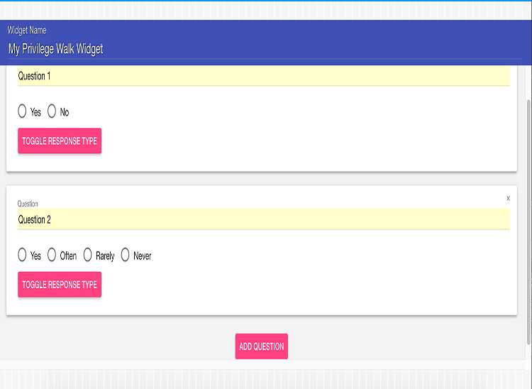

<h1>
    
    Privilege Walk: A Materia Widget
</h1>

Privilege Walk is a survey that asks students several questions and assigns them a score that indicates the amount of privilege they have in their own life.  The student is then shown their score in contrast to their classmates to annonomously inform students

. Privilege Walk is designed for use with [Materia](https://github.com/ucfopen/Materia), an open-source platform for interactive course content developed by the University of Central Florida.

### Basic Use

In a production evironment, Privilege Walk is installed to your Materia instance and is accessed via the Widget Catalog. For development, Privilege Walk is bundled with the [Materia Widget Development Kit](https://github.com/ucfopen/Materia-Widget-Dev-Kit), which allows for rapid development in a local context using express.js.

### Local Development

Privilege Walk uses the Materia Widget Development Kit for location development. Check out [the docs for the MDK](https://ucfopen.github.io/Materia-Docs/develop/materia-widget-development-kit.html) to learn more about starting up the local express environment.

### Installation to Materia

Widget installation options are covered in the [Installing Widgets](https://ucfopen.github.io/Materia-Docs/admin/installing-widgets.html) section of the Materia Docs.

For more information about the widget development process, be sure to visit the [widget developer guide](https://ucfopen.github.io/Materia-Docs/develop/widget-developer-guide.html) for Materia.
