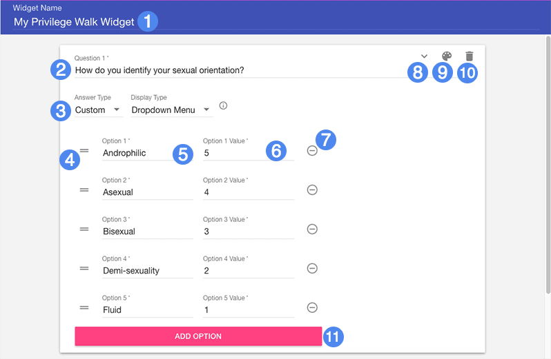
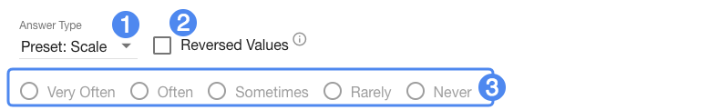

# Creator Guide #

## Overview ##

Privilege Walk is a widget that asks students to consider their societal privilege through a short questionnaire, then allows them to anonymously compare themselves to other users. It's based on several variations of a classroom activity that provide a numeric or representational "score" to a student's cumulative social privilege and use that score to compare themselves to peers.

1. Widget title
2. Question text
3. Answer and display type selection
4. Drag handles to reorder answers (custom answers only)
5. Response text
6. Numeric value of this response
7. Remove this response
8. Reorder question arrow(s)
9. Response group selection
10. Remove this question
11. Add a new response option

Each question should provide a range of response values with a numeric valuation attached to each. The valuation should be consistent with the framing of the question and the value that response should contribute to the student's overall total.

## Details ##

Answers can be selected from two presets: **Yes/No** which offers a more binary choice, and **Scale** which provides a broader range of opinions. These presets have predetermined values baked in (1-5).

1. Answer type selection
2. Reverse answer value order
3. Preset response range (for display only)

Answers can also be custom authored, by selecting **Custom** under the Answer Type drop-down. With this answer type selected, you can provide a number of responses yourself and provide the value each one will yield when selected.

### Display Type ###

When the **Custom** answer type is selected, you can choose between **Horizontal Scale** and **Dropdown Menu** for displaying the range of responses. Note that the Horizontal Scale option is only available when there are 5 or less responses.

### Groups ###

Questions can be categorically organized into groups. These groups are not visible during the questionnaire section of the widget, but rather are displayed in the score interface after the questionnaire is concluded. You can optionally customize a color for each group along with its name.