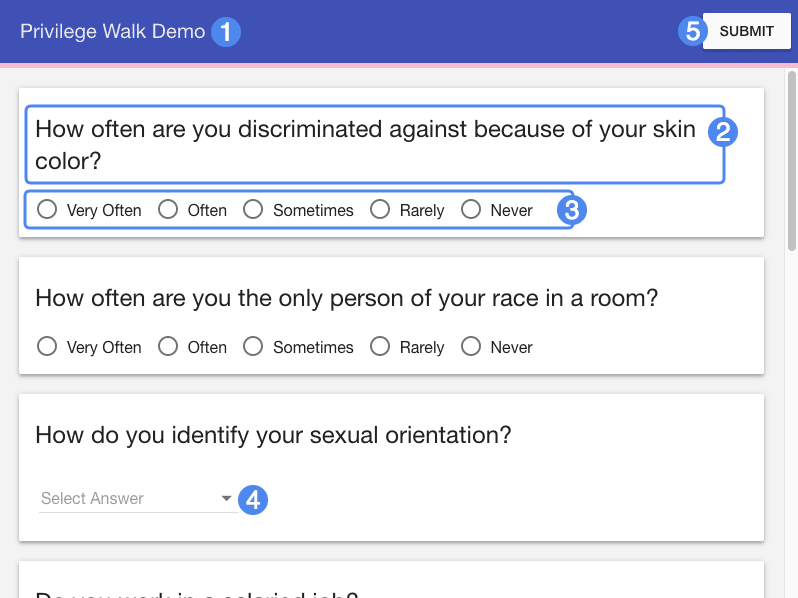
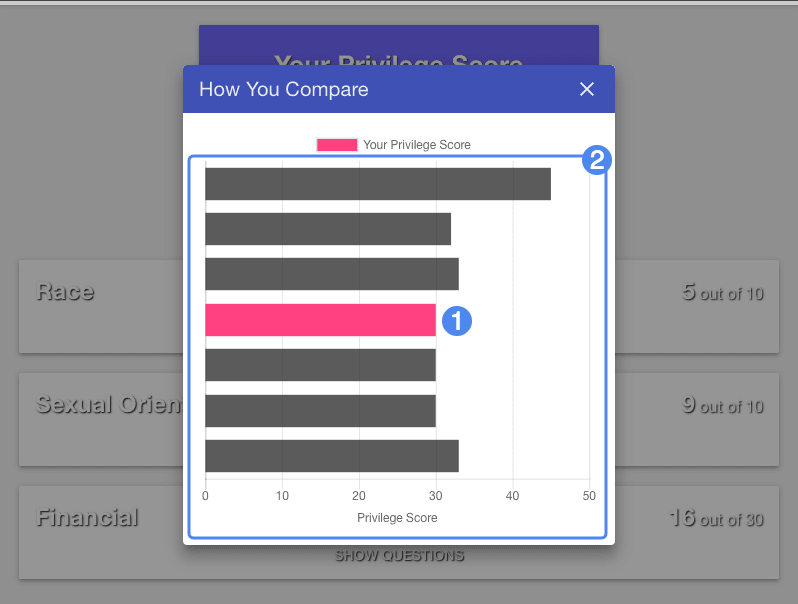

# Player Guide #

## Overview ##

Privilege Walk is a widget that asks students to consider their societal privilege through a short questionnaire, then allows them to anonymously compare themselves to other users.

1. Widget title
2. Question
3. Responses (opinion range)
4. Responses (drop-down)
5. Submit button

## Details ##

Once submitted, students are provided with a breakdown of their responses, a numerical "score", and a bar graph to compare their responses with other students who have completed the widget.

1. Privilege score
2. Distribution graph

